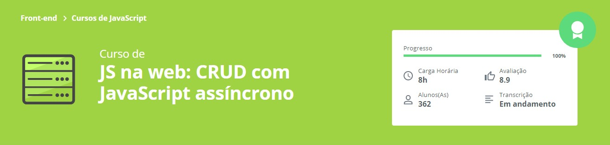

<h1 align="center">:elephant:CRUD com Javascript:elephant:</h1>

Curso de JS na web: CRUD com JavaScript assíncrono

        

## :clipboard: Visão Geral
        Repositório criado para armazenar códigos com intuito apenas de aprender.
CRUD (acrónimo do inglês Create, Read, Update and Delete) são as quatro operações básicas (criação, consulta, atualização e destruição de dados) utilizadas em bases de dados relacionais (RDBMS) fornecidas aos utilizadores do sistema.
#### Qual foi a motivação?
Sendo o CRUD um grande pilar de desenvolvimento de qualquer estrutura de programação, visto isso, coloquei em prática essa criação para também consumir uma API, fortificar minhas habilidades com Javascript e melhorar minha noção de refatoração de código.
## :books: O que  foi desenvolvido no curso?

- Comunicação assíncrona
- Promises
- Fetch API
- CRUD
- Async/Await

## :link: Links

- Acesso o curso: https://cursos.alura.com.br/course/javascript-crud-assincrono
- https://www.linkedin.com/in/guilhermesoterio/
- https://www.javascript.com/
